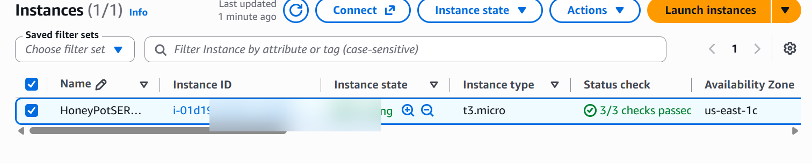
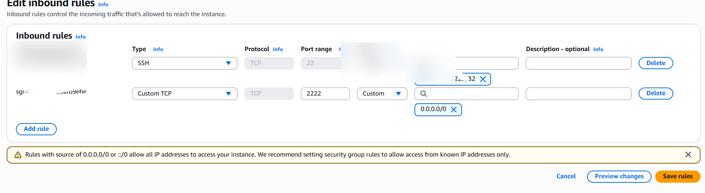
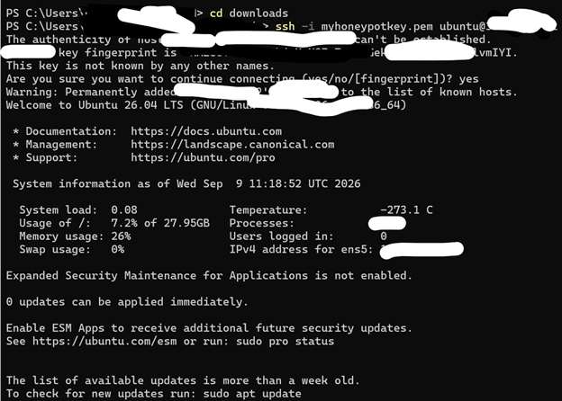
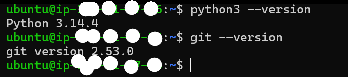
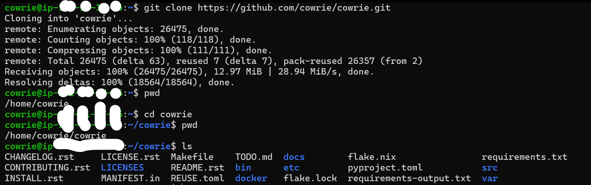
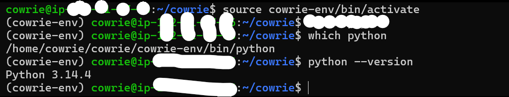
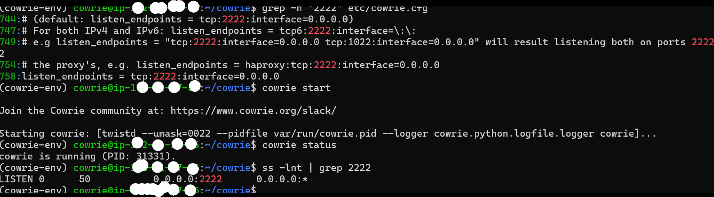
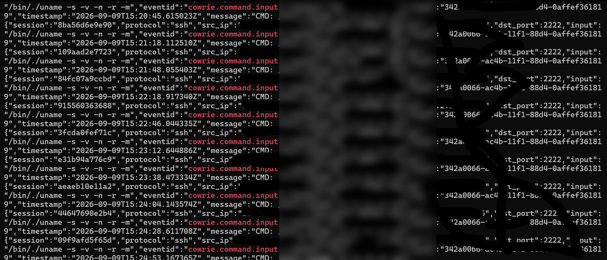

# 🛡️ AWS Cowrie SSH Honeypot

> Deploying a Cowrie SSH honeypot on AWS EC2 to capture, analyze, and document real-world SSH scanning and authentication activity.

## Full Project Documentation

For a complete visual walkthrough of the AWS deployment, security configuration, Cowrie installation, controlled testing, observed activity, log analysis, challenges, and lessons learned:

➡️ **[View the Complete AWS Cowrie Honeypot Project (PDF)](docs/AWS-Cowrie-Honeypot-Project.pdf)**

The PDF provides a step-by-step visual walkthrough of the project, while this README provides the technical documentation and key findings.

## SOC Analysis Follow-up

After collecting additional Cowrie telemetry, I carried out a SOC-style follow-up investigation covering automated password guessing, post-authentication activity, MITRE ATT&CK mapping, masked source indicators, analyst limitations, and recommended escalation actions.

➡️ **[View the SOC Analysis Follow-up](analysis/README.md)**


## Project Overview

As part of my cybersecurity learning journey, I wanted to move beyond analyzing prepared datasets and build a live environment where I could observe how Internet-facing systems are discovered and probed.

The idea was inspired by a honeypot analysis project I completed during my cybersecurity internship with the Ubuntu Bridge Initiative.

I initially attempted to deploy T-Pot on AWS. However, the limited resources available on the EC2 instance caused problems with Docker and the services required by T-Pot.

Rather than abandoning the project, I changed my approach and deployed **Cowrie**, a lightweight SSH/Telnet honeypot designed to log brute-force attempts and attacker interactions.

The final environment allowed me to observe unsolicited SSH activity, perform controlled testing, analyze Cowrie JSON logs, and practice evidence preservation.


## Project Objectives

The objectives of this project were to:

- Deploy an Internet-facing honeypot in AWS.
- Secure administrative access to the underlying server.
- Separate real SSH administration from the honeypot service.
- Capture SSH connection and authentication activity.
- Observe commands executed inside the decoy environment.
- Analyze Cowrie JSON logs.
- Distinguish controlled testing from unsolicited Internet activity.
- Preserve collected evidence safely.
- Develop practical SOC and threat-analysis skills.


## Architecture

The environment was designed so that the real Ubuntu server and the Cowrie honeypot used different SSH ports.


                    Internet
                       |
                       |
                AWS Security Group
                  /           \
                 /             \
        TCP Port 22          TCP Port 2222
             |                    |
             |                    |
      Real Ubuntu EC2       Cowrie Honeypot
             |                    |
     Administrative          Decoy SSH Service
         Access             / Attacker Activity
             |
      Restricted to
    Administrator IP
```

### Port Separation

| Port | Service | Purpose | Exposure |
|------|---------|---------|----------|
| TCP 22 | Ubuntu SSH | Real server administration | Restricted to my administrative IP |
| TCP 2222 | Cowrie SSH | Honeypot / decoy SSH service | Internet-facing |

This separation was important because **port 22 provided access to the real EC2 instance**, while **port 2222 connected users to the Cowrie environment**.

---

## 1. AWS EC2 Deployment

I created an Ubuntu Server EC2 instance in AWS to host the honeypot.

The deployment process included:

1. Creating an EC2 instance.
2. Selecting Ubuntu Server.
3. Creating an SSH key pair.
4. Configuring the instance storage.
5. Creating a Security Group.
6. Restricting administrative SSH access.
7. Allowing traffic to the Cowrie SSH service.
### AWS EC2 Instance

The Ubuntu EC2 instance used to host the Cowrie honeypot:




## 2. Security Group Configuration

One of the most important parts of the deployment was ensuring that the real SSH management interface was not unnecessarily exposed.

### Real SSH — TCP Port 22

Port 22 was restricted to my administrative public IP.

This allowed me to manage the Ubuntu server without exposing the real SSH service to the entire Internet.

### Cowrie — TCP Port 2222

Port 2222 was opened for the Cowrie SSH honeypot.

This allowed Internet systems to interact with the decoy SSH service while keeping the actual administrative SSH service separate.
### Security Group Rules

The Security Group separated administrative access from the honeypot service. TCP port 22 was used for real SSH administration, while TCP port 2222 was exposed for Cowrie.




## 3. Connecting to the Real EC2 Server

From my Windows computer, I connected to the actual Ubuntu EC2 instance using my private key.

Example:

```bash
ssh -i "myhoneypotkey.pem" ubuntu@<EC2-PUBLIC-IP>
```
### Successful Administrative SSH Connection

The screenshot below shows a successful SSH connection from my Windows machine to the real Ubuntu EC2 instance using TCP port 22 and the associated private key.



> Sensitive information, including the public IP address and local identifying information, has been redacted.
A successful connection displayed the Ubuntu login banner and system information.

> **Note:** Public IP addresses and identifying information shown in the project screenshots have been sanitized before publication.


## 4. Preparing the Ubuntu Server

After connecting to the server, I verified the tools required for the project.

```bash
python3 --version
git --version
```
### Dependency Verification

I verified that Python and Git were available before proceeding with the Cowrie installation.


I then prepared the environment required to install Cowrie.


## 5. Installing Cowrie

I cloned the Cowrie repository:

```bash
git clone https://github.com/cowrie/cowrie.git
```

I entered the Cowrie directory:

```bash
cd cowrie
```

I created a Python virtual environment:

```bash
python3 -m venv cowrie-env
```

I activated the environment:

```bash
source cowrie-env/bin/activate
```

The virtual environment allowed the Python packages required by Cowrie to remain isolated from the system-wide Python installation.
### Cloning the Cowrie Repository

Cowrie was cloned onto the Ubuntu EC2 server and the project directory was verified before continuing with the installation.



### Python Virtual Environment

A dedicated Python virtual environment was created and activated to isolate Cowrie's dependencies from the system Python installation.




## 6. Configuring Cowrie

Cowrie was configured to provide its SSH service on TCP port **2222**.

The SSH listener was configured as:

```text
tcp:2222:interface=0.0.0.0
```

This allowed Cowrie to accept SSH connections on TCP port 2222 while the real Ubuntu SSH service remained on TCP port 22.
### Verifying the Cowrie Listener

After configuration, I verified that Cowrie was running and listening on TCP port 2222.


---

## 7. Controlled Testing

Before analyzing unsolicited Internet traffic, I performed a controlled SSH connection to verify that the honeypot was working.

From my Windows computer:

```bash
ssh -p 2222 admin1@<EC2-PUBLIC-IP>
```

It is important to distinguish this from:

```bash
ssh -i "myhoneypotkey.pem" ubuntu@<EC2-PUBLIC-IP>
```

The first command connects to **Cowrie on port 2222**.

The second command connects to the **real Ubuntu EC2 server on port 22**.

Inside the Cowrie environment, I tested commands such as:

```bash
whoami
pwd
ls
cd /tmp
ls -lh
cat /etc/passwd
cat /etc/hostname
```

These commands interacted with Cowrie's simulated environment rather than the underlying Ubuntu operating system.


## 8. Observing Internet Activity

After the honeypot was exposed, Cowrie began recording unsolicited Internet activity.

The activity included:

- SSH connections
- Authentication attempts
- Automated scanning
- Short-lived SSH sessions
- System reconnaissance
- Command execution

One recurring reconnaissance command observed in the logs was:

```bash
/bin/./uname -s -v -n -r -m
```

Repeated execution of commands like this indicated automated attempts to obtain information about the target environment.


## 9. Log Analysis

Cowrie stored detailed activity logs that I could use to investigate individual sessions.

The logs were located under:

```text
~/cowrie/var/log/cowrie/
```

The JSON events contained useful fields such as:

```text
timestamp
src_ip
src_port
dst_port
session
protocol
eventid
input
message
sensor
```

These fields helped me determine when connections occurred, identify individual sessions, review authentication activity and reconstruct commands entered during a session.
### Cowrie JSON Log Evidence

The Cowrie JSON logs provided visibility into connection events, sessions and commands executed inside the decoy environment.



> Source information and other potentially sensitive identifiers have been sanitized before publication.


## 10. Observed Dataset

During the observation period, analysis of the collected and rotated Cowrie logs produced the following results:

| Metric | Observed |
|--------|---------:|
| Connection events | 54 |
| Successful decoy logins | 25 |
| Commands recorded | 40 |
| Unique source IPs | 25 |
| File downloads | 0 |

### Important Interpretation

A **successful Cowrie login does not mean that the real EC2 server was compromised**.

Authentication occurred inside the intentionally exposed Cowrie deception environment.

The dataset also contained some of my controlled testing activity, so these figures should not be interpreted as representing malicious activity exclusively.


## 11. Evidence Preservation

An important part of the exercise was preserving the collected evidence rather than simply viewing the logs.

I archived the Cowrie evidence for offline analysis and generated a SHA-256 hash of the evidence archive.

This introduced an important incident-response principle:

**Collect → Preserve → Hash → Analyze**


## Challenges Encountered

The project did not work perfectly on the first attempt.

My original plan was to deploy **T-Pot**, but the AWS instance I was using did not have sufficient resources for the Docker-based deployment I attempted.

Rather than abandoning the project, I researched lighter alternatives and moved to **Cowrie**.

Other challenges I encountered included:

- SSH private-key permissions
- Understanding public versus private EC2 addresses
- Configuring AWS Security Groups
- Understanding TCP listener configuration
- Working with Python virtual environments
- Reading large JSON log files
- Separating real server access from honeypot access

Troubleshooting these issues became an important part of the learning experience.


## Key Lessons Learned

This project strengthened my practical understanding of:

- AWS EC2
- AWS Security Groups
- Linux administration
- SSH authentication
- Public and private IP addressing
- Python virtual environments
- Cowrie honeypot deployment
- Network ports and exposure
- JSON security-log analysis
- Attacker reconnaissance behaviour
- Session analysis
- Evidence preservation
- SHA-256 hashing
- Threat hunting
- SOC-style investigation

Most importantly, the project helped me move from reading about attacker behaviour to collecting and analyzing security telemetry from a controlled environment.


## Security Considerations

The environment was intentionally designed to reduce risk.

- Real administrative SSH access was restricted.
- Cowrie was separated from the real SSH service.
- Honeypot activity was treated as untrusted.
- Sensitive information was removed from published screenshots.
- Public IP addresses were masked.
- Private SSH keys and credentials are not included in this repository.


## Disclaimer

This project was conducted for **educational and cybersecurity research purposes** in a controlled cloud environment that I owned and managed.

Sensitive information, credentials, administrative IP addresses and personally identifiable information have been removed or sanitized before publication.


## Future Improvements

Future improvements could include:

- Forwarding Cowrie logs to a SIEM.
- Building dashboards for honeypot activity.
- Automating command and source-IP analysis.
- Adding threat-intelligence enrichment.
- Mapping observed behaviour to MITRE ATT&CK.
- Creating alerts for interesting sessions.


## Author

**Ayodeji Ogungbire**

IT Infrastructure & Support Professional | Cybersecurity Enthusiast | Cloud Engineer

This project forms part of my practical cybersecurity learning and portfolio development.
